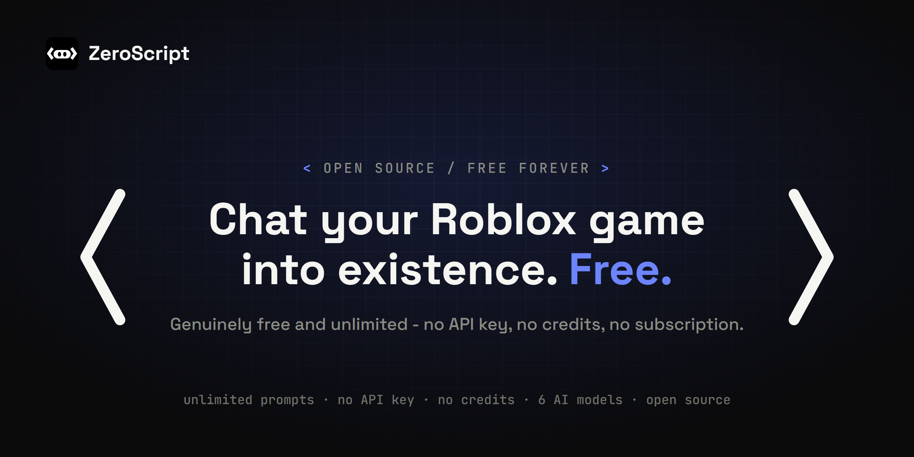

# Mechablox Connect — Kontrol Roblox Studio dari HP

**HP (Gemini/DeepSeek) → PC (Roblox Studio MCP)**

Fork dari [sebattfg/ZeroScript-Free](https://github.com/sebattfg/ZeroScript-Free) v1.5.4 + patch remote **1.5.4-remote**. Aslinya ZeroScript cuma `ws://127.0.0.1:17613` (localhost), jadi Gemini di HP tidak bisa capai Bridge di PC. Repo ini patch biar bisa remote.



## Apa yang beda dari ZeroScript Free?
- `bridge.py:74` → `HOST = 0.0.0.0` (env `ZS_BRIDGE_HOST`), bisa diakses LAN/Tailscale
- `background.js` → `zsBridgeUrl` configurable via `chrome.storage.local` (ganti tanpa rebuild)
- `manifest.json` → `host_permissions` tambah `ws://192.168.*/*`, `ws://100.*/*`, `wss://*/*` (ngrok/cloudflare)
- `popup.html/js` → UI input **Bridge URL** + Save & Reconnect + status URL
- Optional token auth `ZS_BRIDGE_TOKEN` untuk tunnel publik

## Opsi Koneksi

### Opsi 1: Satu WiFi (3 menit, tanpa tunnel) — REKOMENDASI awal
PC dan HP satu WiFi sama.

**PC:**
```bash
netsh advfirewall firewall add rule name="Mechablox Bridge" dir=in action=allow protocol=TCP localport=17613
ipconfig  # catat IPv4 192.168.1.xx
python bridge.py  # harus listening on ws://0.0.0.0:17613
# Buka Roblox Studio -> Assistant AI -> ... -> Manage MCP Servers -> Enable Studio as MCP Server (dot hijau)
```

**HP:**
1. Install **Lemur Browser** (Play Store) — Chrome Android tidak support extension
2. Kirim folder `zeroscript-extension` ke HP, di Lemur: `:` -> Extensions -> Developer mode ON -> Load unpacked
3. Buka `gemini.google.com`, klik puzzle icon -> Mechablox Connect -> Bridge URL: `ws://192.168.1.xx:17613` -> Save & Reconnect
4. Dot hijau = `Connected · Roblox Studio ready` -> di Gemini klik `Start session`

Lihat `CARA_PAKAI_OPSI1_LAN.md` lengkap.

### Opsi 2: Tailscale (beda jaringan, aman)
PC & HP install Tailscale, login akun sama. `tailscale ip -4` di PC → `100.x.x.x`, HP isi `ws://100.x.x.x:17613`. Terenkripsi, tanpa buka port publik.

### Opsi 3: Cloudflare Tunnel / Ngrok (publik wss)
```bash
cloudflared tunnel --url http://localhost:17613
# dapat https://xxx.trycloudflare.com -> HP isi wss://xxx.trycloudflare.com
# jika pakai token:
set ZS_BRIDGE_TOKEN=rahasia123
python bridge.py
# HP: wss://xxx.trycloudflare.com/?token=rahasia123
```
Tanpa token, orang yang tau URL bisa `execute_luau` apapun di Studio kamu!

## Install Extension di HP (Lemur)

- Kirim zip ini ke HP, extract dengan ZArchiver
- Lemur -> Extensions -> Load unpacked -> pilih folder `zeroscript-extension`
- Gemini/DeepSeek/Kimi/ChatGPT semua support (Gemini kadang berhenti pakai tools di sesi panjang — bug model, ganti ke DeepSeek kalau ngambek)

## Troubleshooting
- Grey dot: salah IP / firewall / beda WiFi. Coba buka `http://192.168.1.xx:17613` di HP harus konek (bukan timeout)
- Kuning: Bridge OK tapi Studio belum open / MCP belum enable
- Port dipakai: `netstat -ano | findstr 17613`

## Credit
Original by [sebattfg](https://github.com/sebattfg/ZeroScript-Free) (GPL-3.0). Patch remote by myzakonz-gif (Mechablox Connect).

## License
GPL-3.0 — sama seperti upstream.
